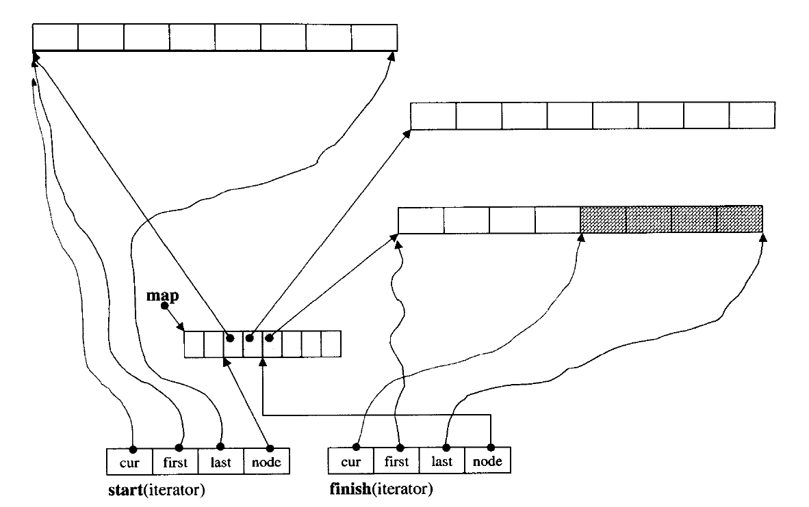

# deque文档

​		deque,她的意思为双端队列(double-ended queue)。逻辑上看，deque和vector都是连续空间。相比于vector只能从尾部增长元素，而deque可在双侧增加元素。但是从存储结构上，deque并非是连续空间存储的。它是分段连续的。对于vector存储（申请的内存）的增长，可以描述为三个步骤1.申请内存2.搬移元素3释放原先的使用的内存。而由于deque其特殊的数据结构，如下图所示，省去这三个步骤。（但是仍然需要申请buffer去存储新元素，不用去搬移旧有元素了）。

​		deque的组成(数据成员)：

```C++
iterator start;
iterator finish;
map_pointer map;
size_type mapsize;//map大小
```

​		由于其特殊的数据结构，其迭代器的设计也会较为繁琐。因为是分段连续的。尤其是跨过分段是的特殊处理需要尤其注意。对于下图的说明：map存储着各个buffer(存储数据的数据段)的指针。迭代器（start,finish）则存储着该元素所在buffer的首尾，以及，目前所在位置（cur)，还有其所在buffer在map上的信息。因此迭代器的设计较与vector的设计还是非常复杂的。



​		

​		

## deque的构造与析构

构造函数：与vector,string之前的构造函数类似

|       构造函数类型 | 具体函数                                                     |
| -----------------: | ------------------------------------------------------------ |
|        default (1) | deque();<br> explicit deque (const allocator_type& alloc);   |
|           fill (2) | explicit deque (size_type n, const allocator_type& alloc = allocator_type());  <br> deque (size_type n, const value_type& val, const allocator_type& alloc = allocator_type()); |
|          range (3) | template < class InputIterato r><br>deque (InputIterator first, InputIterator last, const allocator_type& alloc = allocator_type()); |
|           copy (4) | deque (const deque& x); <br>deque (const deque& x, const allocator_type& alloc); |
|           move (5) | deque (deque&& x); <br>deque (deque&& x, const allocator_type& alloc); |
| initializerlist(6) | deque (initializer_list il, const allocator_type& alloc = allocator_type()); |


= 赋值

|         赋值函数类型 | 等号重载                                                     |
| -------------------: | ------------------------------------------------------------ |
|             copy (1) | deque& operator= (const deque& x); //拷贝赋值函数            |
|             move (2) | deque& operator= (deque&& x); //移动赋值函数                 |
| initializer list (3) | deque& operator= (initializer_list il);//利用初始化列表进行赋值 |

assign

|         赋值函数类型 | 重载                                                         |
| -------------------: | ------------------------------------------------------------ |
|            range (1) | template   void assign (InputIterator first, InputIterator last); |
|             fill (2) | void assign (size_type n, const value_type& val) ;           |
| initializer list (3) | void assign (initializer_list il);                           |


## deque元素访问

### 迭代器(类指针访问方式)

​		值得注意的是：虽然deque的内存表现不是连续的（分段连续），但是通过存储的数据，通过对一些符号的重载，仍能使得我们像连续空间那样去使用迭代器。**迭代器只不过是定义了一堆行为像指针的类而已。**对于下面的各个函数，其中以“c"开头的函数（如cbegin()、cend())，返回的是const iterator类型（类似于指向常量的指针），而"r"与”cr“开头表示(const and reverse)，反向迭代器以及常量反向迭代器。

| Iterators         |                                                              |
| ----------------- | ------------------------------------------------------------ |
| begin<br>cbegin   | returns an iterator to the beginning (public member function) |
| end<br>cend       | returns an iterator to the end (public member function)      |
| rbegin<br>crbegin | returns a reverse iterator to the beginning (public member function) |
| rend<br>crend     | returns a reverse iterator to the end (public member function) |

### 元素访问

| Element access | 函数原型及其说明                                             |
| -------------- | ------------------------------------------------------------ |
| at             | access specified element with bounds checking (public member function),带有边界检查的访问特定元素访问方式<br>reference at( size_type pos );<br>const_reference at( size_type pos ) const; |
| operator[]     | access specified element (public member function)<br>reference       operator[ ] ( size_type pos );<br>const_reference operator[ ] ( size_type pos ) const; |
| front          | access the first element (public member function)<br>reference front();<br/>const_reference front() const; |
| back           | access the last element (public member function)<br>reference back();<br/>const_reference back() const; |

## 容量与大小

不同与vector,string有capacity函数可以查看已经申请的空间。而deque不行。实际通过了解其的数据成员可以知道，不像vector有end_of_storage这样的迭代器，并且也可以知道他也

| Capacity             | 函数原型及说明                                               |
| -------------------- | ------------------------------------------------------------ |
| empty                | checks whether the container is empty (public member function),判断容器是否为空<br>bool empty() const; |
| size                 | returns the number of elements (public member function)<br>size_type size() const; |
| max_size             | returns the maximum possible number of elements (public member function)，返回可能的最大元素个数<br>size_type max_size() const; |
| shrink_to_fit(C++11) | reduces memory usage by freeing unused memory (public member function),可以释放内存<br>void shrink_to_fit(); |

## 容器修改

​		对于clear函数。对于vector不会释放其内存空间。而clear会。（这点可以通过申请一个比较大的内存的deque,然后观察程序的占用内存变化，可以清楚看到deque的clear是会释放内存的)。对于使用clear后的所占有的内存大小。可以参考，《STL源码分析》中的一段话：**deque的最初状态（无任何元素时）保有一个缓冲区，因此，clear()完成之后回复初始状态，也一样要保留一个缓冲区。**

​		对于emplace，这个函数是想要通过传入的参数以及所申请的空间，直接在指定位置构造新元素。由于内存结构仍然是线性的，所以在中间部分emplace的效率仍然是很低的，不如list以及foward_list。

​		对于swap。在vector有这样的小技巧（可以使一个vector对象与一个右值swap,可以达到释放空间的目的）

```
vector<int> v1{1,2,3};
v1.swap((vector<int>){1});//对于vector可行，对于deque不可行，因为没有传入右值参数的函数原型

```


| Modifiers           | 函数原型及说明                                               |
| ------------------- | ------------------------------------------------------------ |
| clear               | clears the contents (public member function),清除内容，所有迭代器失效。*deque的clear会清除部分申请的内存空间！*<br>void clear(); |
| insert              | inserts elements (public member function)依据传入参数分类<br>single element (1)	单元素<br/>iterator insert (iterator position, const value_type& val);<br/>fill (2)	填充<br/>void insert (iterator position, size_type n, const value_type& val);<br/>range (3)	通过迭代器的范围插入（要求值类型一致）<br/>template < class InputIterator ><br/>void insert (iterator position, InputIterator first, InputIterator last); |
| emplace(C++11)      | constructs element in-place (public member function)在指定位置构造元素<br>template <class... Args><br/> iterator emplace (const_iterator position, Args&&... args); |
| erase               | erases elements (public member function)<br>iterator erase (const_iterator position );<br>iterator erase (const_iterator first, const_iterator last ); |
| push_back           | adds an element to the end (public member function)<br>void push_back (const value_type& val);<br/>void push_back (value_type&& val); |
| emplace_backC++11)  | constructs an element in-place at the end (public member function)<br>template <class... Args>  <br> void emplace_back (Args&&... args); |
| pop_back            | removes the last element (public member function)<br/>void pop_front(); |
| push_front          | inserts an element to the beginning (public member function)<br/>void push_front (const value_type& val);<br/>void push_front (value_type&& val); |
| emplace_frontC++11) | constructs an element in-place at the beginning (public member function)<br/>template <class... Args>  <br/> void emplace_front (Args&&... args); |
| pop_front           | removes the first element (public member function)<br/>void pop_front(); |
| resize              | changes the number of elements stored (public member function)<br>void resize (size_type n);<br>void resize (size_type n, const value_type& val); |
| swap                | swaps the contents (public member function)<br>void swap (deque& x); |


## Reference

[1]《STL源码剖析》候捷

[2]C++ STL 体系结构与内核分析--从平地到万丈高楼-----候捷视频课程,https://www.bilibili.com/video/av45108908

[3]

[4]